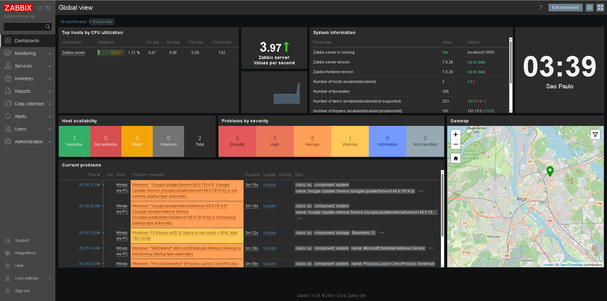
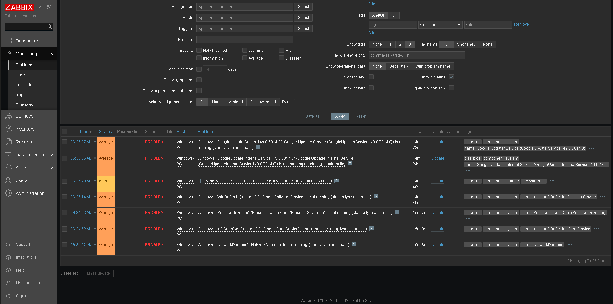
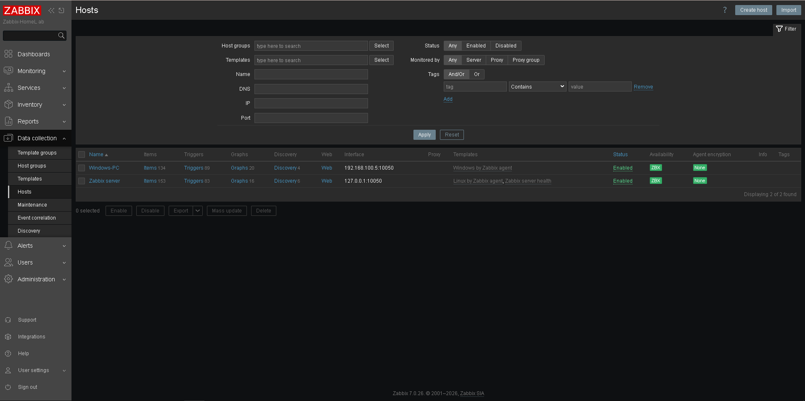

# Zabbix HomeLab — Monitoring Infrastructure Project

## Overview
Full Zabbix 7.0 monitoring environment built from scratch as part of my DevSecOps portfolio.
Currently working as NOC Analyst N1 at Cybercorp, Curitiba, Brazil.

## Stack
- **OS:** Ubuntu Server 26.04 LTS (VirtualBox VM)
- **Monitoring:** Zabbix 7.0.26
- **Database:** MySQL 8.4.8
- **Web Server:** Apache 2.4 + PHP 8.5 (FPM)
- **Hosts monitored:** 2 (Linux server + Windows workstation)

## Architecture
Windows PC (Host)
├── VirtualBox
│   └── Ubuntu Server 26.04 (192.168.100.46)
│       ├── Zabbix Server 7.0
│       ├── Zabbix Agent
│       ├── Apache + PHP-FPM
│       └── MySQL 8.4
└── Zabbix Agent (Windows) → monitored by Zabbix

## What was configured
- Ubuntu Server installation and hardening
- MySQL database setup with dedicated user and permissions
- Zabbix 7.0 full stack installation
- SSH remote access configuration
- Windows host monitoring with Zabbix Agent
- Real alerts triggered: disk space, stopped services

## Screenshots

### Dashboard with real alerts

### Active problems detected

### Monitored hosts

## Skills demonstrated
- Linux Server administration
- Network monitoring
- Database management
- Troubleshooting (resolved 4 real installation errors)
- SSH remote management
- Infrastructure documentation

## Next steps
- [ ] Configure custom triggers and alerts
- [ ] Add Wazuh SIEM
- [ ] Automate setup with bash script
- [ ] Add Docker monitoring
